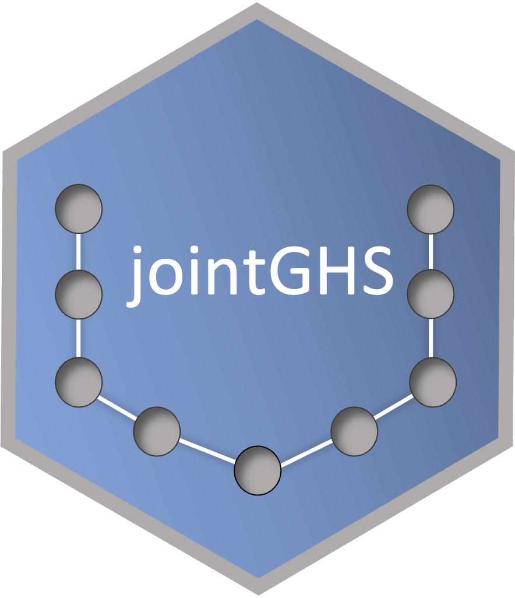
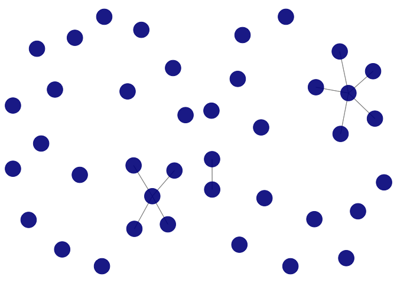

<!-- README.md is generated from README.Rmd. Please edit that file -->
<!-- badges: start -->

[](https://www.tidyverse.org/lifecycle/#experimental)
[](https://opensource.org/licenses/MIT)
<!--[](https://codecov.io/gh/Camiling/JoStARS) -->
<!--[](https://github.com/Camiling/JoStARS/actions) -->
<!-- badges: end -->

<!-- IF ON CRAN []
[]---->
<!--PAPER HERE []---->

# `jointGHS` 

The `jointGHS` package implements the joint graphical horseshoe for
multiple network estimation, in the setting of Gaussian graphical
models. The package provides a scalable expectation conditional
maximisation (ECM) algorithm for obtaining the posterior mode of the
precision matrices (inverse covariance matrices). The non-zero
off-diagonal elements of the resulting matrices correspond to the edges
identified. The method borrows information between networks in order to
increase statistical power, while ensuring information is only shared to
the degree that it improves the network estimates. The method takes a
list of data matrices for which separate graphs are to be inferred, and
shares edge wise information between them through a common edge-specific
latent variable. The resulting method captures what is common between
the networks while preserving their differences, and can be used
agnostically for any level of similarity between the networks.

## Installation

This package requires the package `fastGHS` to be installed. To install
the current development version of both packages, use

``` r
remotes::install_github("camiling/fastGHS")
remotes::install_github("camiling/jointGHS")
```

If you would like to install all packages of the models we currently
support, use

``` r
remotes::install_github("camiling/jointGHS", dependencies = TRUE)
```

If you would also like to build and view the vignette locally, use

``` r
remotes::install_github("camiling/jointGHS", dependencies = TRUE, build_vignettes = TRUE)
browseVignettes("jointGHS")
```

## Example

The main function `jointGHS` takes a list of *K* data matrices, each of
dimension *n*<sub>*k*</sub> × *p* where *n*<sub>*k*</sub> is the sample
size of data set *k*, for which separate graphs are to be inferred. The
methods estimates the posterior mode of each precision matrix in the
joint graphical horseshoe.

The following examples show how `jointGHS` identifies the common edges
for a set of *K* = 2 graphs, as well as the individual edges on the
network-level, and returns the resulting precision matrix estimates. One
example with *K* = 2 data sets drawn from the same distribution, and one
with *K* = 2 data sets drawn from completely unrelated distributions, is
shown. In the first case, jointGHS identifies a large number of common
edges. This results in high precision considering the high
dimensionality of the problem. In the latter case, hardly any common
edges are found and little similarity between the two graphs is
encouraged.

The data is generated using the R package `huge` (Jiang et al. (2020)),
as it includes functionality for generating data from a Gaussian
graphical model. The networks we generate are *scale-free*, which is a
known trait in many real-life networks such as genomic networks
(Kolaczyk (2009)).

``` r
#  example 1: scale-free data where the data sets are from the same distribution
set.seed(123)
n1 <- 60 # let there be different number of samples in each data set
n2 <- 50
p <- 20 # Still very high-dimensional: 190 potential edges
dat <- huge::huge.generator(n = n1, d = p, graph = "scale-free")
#> Generating data from the multivariate normal distribution with the scale-free graph structure....done.
dat$sparsity # true sparsity level
#> [1] 0.1
prec.mat <- dat$omega # the true precision matrix of both data sets
x1 <- MASS::mvrnorm(n1, mu = rep(0, p), Sigma = dat$sigma) # data set 1
x2 <- MASS::mvrnorm(n2, mu = rep(0, p), Sigma = dat$sigma) # data set 2
Y <- list(x1, x2)
res <- jointGHS(Y, epsilon = 1e-3, AIC_eps = 1e-3)
#> Itr = 1 Max diff = 1.33782
#> Itr = 2 Max diff = 0.516578
#> Itr = 3 Max diff = 0.252108
#> Itr = 4 Max diff = 0.26906
#> Itr = 5 Max diff = 0.21549
#> Itr = 6 Max diff = 0.141899
#> Itr = 7 Max diff = 0.0966643
#> Itr = 8 Max diff = 0.0717372
#> Itr = 9 Max diff = 0.0538701
#> Itr = 10 Max diff = 0.0376116
#> Itr = 11 Max diff = 0.0348739
#> Itr = 12 Max diff = 0.0302589
#> Itr = 13 Max diff = 0.0170074
#> Itr = 14 Max diff = 0.00408906
#> Itr = 15 Max diff = 0.000952573
#>  done
adj.mat1 <- abs(cov2cor(res$theta[[1]])) > 1e-5 # the estimated adjacency matrix of graph 1
adj.mat2 <- abs(cov2cor(res$theta[[2]])) > 1e-5 # the estimated adjacency matrix of graph 2
sparsity(adj.mat1) # the sparsities of the estimated precision matrices
#> [1] 0.02105263
sparsity(adj.mat2)
#> [1] 0.03157895
# Look at precision of inferred graphs
precision(abs(prec.mat) > 1e-7, adj.mat1)
#> [1] 1
precision(abs(prec.mat) > 1e-7, adj.mat2)
#> [1] 1
# Save for plotting
adj.mat1.1 <- adj.mat1
adj.mat2.1 <- adj.mat2
# example 2: scale-free data where where the data sets are from completely unrelated distributions
set.seed(123)
n1 <- 60
n2 <- 50
p <- 20
dat1 <- huge::huge.generator(n = n1, d = p, graph = "scale-free")
#> Generating data from the multivariate normal distribution with the scale-free graph structure....done.
dat2 <- huge::huge.generator(n = n2, d = p, graph = "scale-free") # second graph is completely unrelated
#> Generating data from the multivariate normal distribution with the scale-free graph structure....done.
dat1$sparsity # true sparsity level for graph 1
#> [1] 0.1
dat2$sparsity # true sparsity level for graph 2
#> [1] 0.1
prec.mat1 <- dat1$omega # the true precision matrix of data set 1
prec.mat2 <- dat2$omega # the true precision matrix of data set 2
x1 <- MASS::mvrnorm(n1, mu = rep(0, p), Sigma = dat1$sigma)
x2 <- MASS::mvrnorm(n2, mu = rep(0, p), Sigma = dat2$sigma)
Y <- list(x1, x2)
res <- jointGHS(Y, epsilon = 1e-3, AIC_eps = 1e-3)
#> Itr = 1 Max diff = 1.23045
#> Itr = 2 Max diff = 0.519223
#> Itr = 3 Max diff = 0.303779
#> Itr = 4 Max diff = 0.213328
#> Itr = 5 Max diff = 0.174649
#> Itr = 6 Max diff = 0.117454
#> Itr = 7 Max diff = 0.0719634
#> Itr = 8 Max diff = 0.0424368
#> Itr = 9 Max diff = 0.0311661
#> Itr = 10 Max diff = 0.030911
#> Itr = 11 Max diff = 0.0293251
#> Itr = 12 Max diff = 0.0226657
#> Itr = 13 Max diff = 0.0105272
#> Itr = 14 Max diff = 0.00227214
#> Itr = 15 Max diff = 0.000390406
#>  done
adj.mat1 <- abs(cov2cor(res$theta[[1]])) > 1e-5 # the estimated adjacency matrix of graph 1
adj.mat2 <- abs(cov2cor(res$theta[[2]])) > 1e-5 # the estimated adjacency matrix of graph 2
sparsity(adj.mat1) # the sparsities of the estimated precision matrices
#> [1] 0.02631579
sparsity(adj.mat2) # Very sparse as little data is available, and no shared information
#> [1] 0.005263158
# slightly lower precision as no information could be borrowed across classes, but still very high
precision(abs(prec.mat) > 1e-7, adj.mat1)
#> [1] 0.8
precision(abs(prec.mat) > 1e-7, adj.mat2)
#> [1] 1
```

The resulting jointGHS graphs can be visualised with functions from the
`network` and `ggnet2` libraries.

``` r
set.seed(1234)
net1 <- network::network(adj.mat1.1)
net2 <- network::network(adj.mat2.1)
g1 <- GGally::ggnet2(net1, alpha = 0.9, color = "darkblue")
#> Registered S3 method overwritten by 'GGally':
#>   method from   
#>   +.gg   ggplot2
g2 <- GGally::ggnet2(net2, alpha = 0.9, color = "darkblue")
ggpubr::ggarrange(g1, g2, ncol = 2, nrow = 1)
```



## Contribution

All feedback and suggestions are very welcome. If you have any questions
or comments, feel free to open an issue
[here](https://github.com/Camiling/jointGHS/issues).

## References

<div id="refs" class="references csl-bib-body hanging-indent">

<div id="ref-huge" class="csl-entry">

Jiang, Haoming, Xinyu Fei, Han Liu, Kathryn Roeder, John Lafferty, Larry
Wasserman, Xingguo Li, and Tuo Zhao. 2020. *Huge: High-Dimensional
Undirected Graph Estimation*. <https://CRAN.R-project.org/package=huge>.

</div>

<div id="ref-kolaczyk09" class="csl-entry">

Kolaczyk, Eric D. 2009. *Statistical Analysis of Network Data: Methods
and Models*. Springer Science & Business Media.

</div>

</div>
